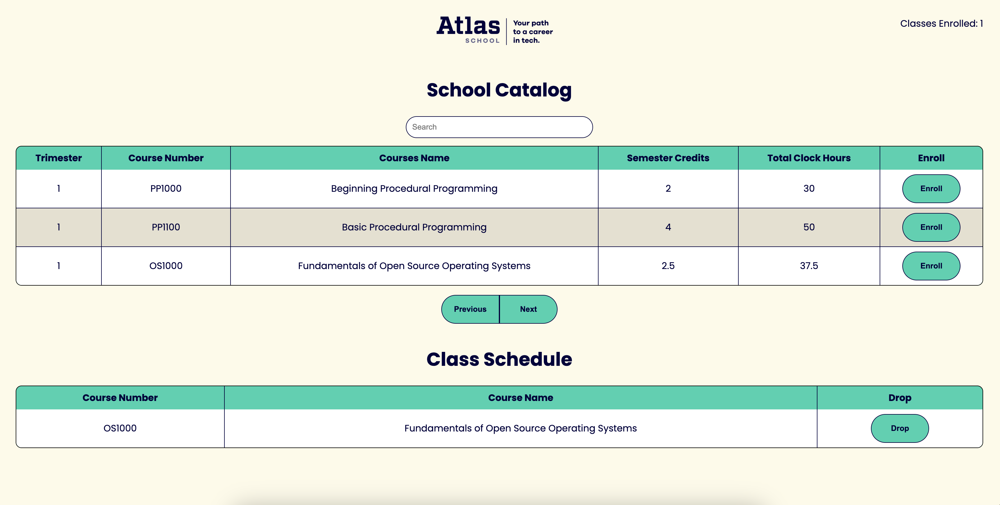

# 0x01 React State Intro

## Getting Started

- Run `npm install` to install dependencies
- Run `npm run dev` to start the dev server
- Open `http://localhost:3000` in a browser

### Important Files/Folders

- `index.html`: This is the html file that appears when the dev server starts up.
- `src`: All javascript/jsx code goes in this directory
- `src/assets`: Any static assets such as images that are loaded through the javascript files goes here.
- `src/app.jsx`: This is the main app component for the entire app.

### Important Commands

- `npm run dev`: Starts dev server with Hot Module Reloading on port 3000. Anytime a file changes, the changes will automatocally be reflected in the browser
- `npm run lint`: Run the lint checker with eslint to check for known linting issues
- `npm run format`: Run prettier to automatically reformat files

## Project:

### Resources:

- [State: a components memory](https://react.dev/learn/state-a-components-memory)
- [Synchronizing with effects](https://react.dev/learn/synchronizing-with-effects)
- [Passing Data Deeply with Context](https://react.dev/learn/passing-data-deeply-with-context)

### Learning Objectives:

- React Hooks
- useState
- useEffect
- Context Providers

### Tasks

#### Fetch Data with API

- Load data using fetch to call `http://localhost:3000/api/courses.json`
- Utilize the `useEffect` hook
- Render a row in the table for each object returned

#### Filtering

- Typing in the search input field should filter the table rows to only show rows that contain the text in the search field.
- The filtering should be case insensitive.
- You will need to utilize the state hook to keep track of the filter.

#### Sorting

- Clicking the column heading should sort the rows by that column in ascending order.
- Clicking the same column a second time should change the ordering to descencing order.
- You will need to utilize state hooks to keep track of which column the data is sorted by and the sort direction.

#### Pagination

- Limit the data shown in the table to 10 rows at a time
- Clickng the Next button should change the table to show the next 10 results.
- Clicking the Previous button should change the table to show the previous 10 results.
- Disable the next button if on the first page of results.
- Disable the previous button if on the last page of results.
- You will need to utilize the state hook to keep track of which page you are on.

#### Enroll in Course

- Create a context provider in the App component that tracks enrolled courses.
- When a user clicks the enroll button, that course should be added to the enrolled courses in the context.
- Enrolled courses should show in the class schedule table

#### Drop Course

- When a user clicks the drop button, that course should be removed from the enrolled courses in the context.
- The course should no longer appear in the call schedule table

#### Course Count

- The course count in the header should reflect the correct number of courses in the class schedule table.
